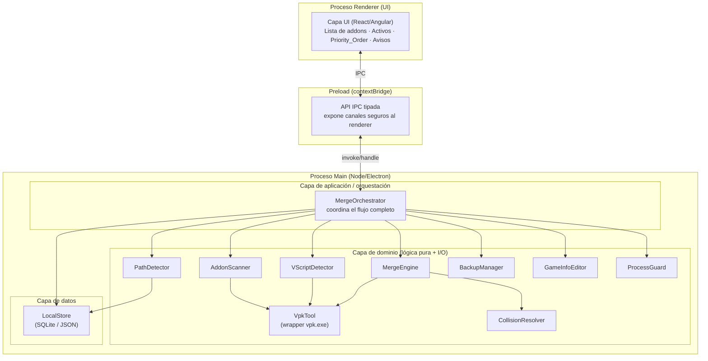
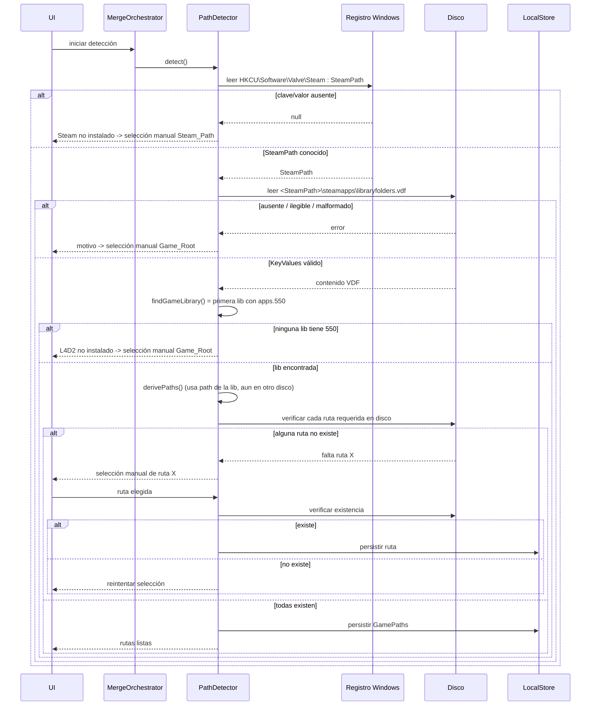
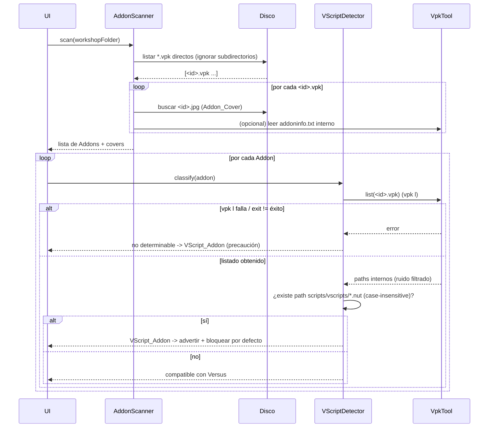

# Design Document

## Overview

El **L4D2 Versus Addon Manager** (en adelante, el *Manager*) es una aplicación de escritorio construida con **Electron + TypeScript** que automatiza el flujo completo de habilitar addons de la Steam Workshop en el modo **Versus** de *Left 4 Dead 2*. El núcleo del problema es que Versus solo carga contenido personalizado si está empaquetado como un único VPK base (`pak01_dir.vpk`) referenciado desde `gameinfo.txt`. Hacer esto a mano —desempaquetar cada addon, fusionar su contenido, reempaquetar e instalar— es tedioso y hay que repetirlo desde cero ante cualquier cambio del conjunto activo.

Este diseño describe el **Núcleo Validado** (Requisitos 1 a 9): detección de rutas, escaneo de la colección, filtro anti-VScript, precondición de seguridad, backup, fusión e instalación, resolución de colisiones, gestión de addons activos y avisos de confianza. La Fase Posterior (Requisitos 10 a 19) se menciona únicamente como consideraciones de extensibilidad al final.

### Principio rector: reflejar exactamente lo validado end-to-end

El mecanismo central de fusión (Opción B) **no es teórico**. Fue validado end-to-end con addons reales del usuario, cargando correctamente en Versus dentro del juego, y la política de colisiones se confirmó por hash SHA256. Todos los detalles de implementación de este documento derivan de esa validación y no de una versión genérica del problema:

- La detección de rutas parte del registro de Windows y del parseo real de `libraryfolders.vdf`.
- El filtro anti-VScript inspecciona el listado real del VPK (nunca el flag `addonContent_Script`).
- La extracción con `vpk x` se hace **por lotes** acotados por longitud de línea de comando (pasar cientos de argumentos de una vez falla con exit `-1` extrayendo 0 archivos).
- La política de colisiones es "el último del Priority_Order gana", aplicada copiando en orden de prioridad ascendente.
- La gestión de activos es siempre **fusión completa desde cero** desde los VPK originales, nunca incremental.

### Stack técnico

| Aspecto | Decisión | Justificación |
|---|---|---|
| Framework de escritorio | Electron | Reutiliza el conocimiento del desarrollador (TS + web), mismo stack que *funky*. |
| Lenguaje | TypeScript | Tipado estático en main y renderer. |
| Frontend (UI) | **Recomendación: React** (Angular sigue siendo válido) | React tiene menor peso de arranque y es el patrón más común en el ecosistema Electron (incl. *funky* usa Svelte, cercano a React en modelo mental). La arquitectura del núcleo es agnóstica del framework; la decisión final no bloquea. |
| Manejo de VPK | `vpk.exe` (Authoring Tools) wrappeado vía `child_process` | Método ya validado end-to-end; da control total y reversibilidad. |
| Persistencia | **Recomendación: SQLite vía `better-sqlite3`** (JSON como alternativa) | Ver la sección Data Models para la justificación completa. |
| Plataforma primaria | Windows | El usuario objetivo y la validación son sobre Windows. Linux/Steam Deck quedan como secundarias. |
| Manifest de privilegios | **`asInvoker`** (no `requireAdministrator`) | La app arranca sin elevación; solo eleva bajo demanda para las escrituras en el Game_Root (ver `ElevationService` y la nota de empaquetado). |

#### Nota de empaquetado y elevación (manifest `asInvoker`)

La instalación de Steam del usuario objetivo está en `C:\Program Files (x86)\Steam` (confirmado por su `libraryfolders.vdf` real), por lo que escribir en `modsvs\` y `gameinfo.txt` **requerirá elevación en la primera prueba real**. Esto no es un caso borde: es el flujo esperado. Implicaciones que el diseño asume explícitamente:

- **(a) Manifest `asInvoker`**: el ejecutable de Electron se empaqueta con manifest `asInvoker`, **no** `requireAdministrator`. El grueso de la app (escaneo, UI, detección de rutas, listado de VPK, clasificación VScript) nunca necesita privilegios y no debe correr elevado. La elevación se dispara **solo bajo demanda** para las operaciones de escritura en el Game_Root (ver `ElevationService`).
- **(b) Ejecutable no firmado**: como el ejecutable **no está firmado** (ya documentado en Req 9.4), el prompt UAC aparecerá como "editor desconocido", y esto se combina con la advertencia de SmartScreen. Ambos avisos son **esperables** en el flujo de elevación.
- **(c) Sin cambio en la decisión de firma**: esto **no** modifica la decisión de no firmar el ejecutable, pero **sí** debe advertirse al usuario que verá el prompt UAC de editor desconocido al instalar/fusionar sobre `Program Files`.

## Architecture

El Manager sigue la separación estándar de Electron entre el **proceso main** y el **proceso renderer**, comunicados por **IPC**. Toda operación privilegiada —acceso al sistema de archivos, registro de Windows, ejecución de `vpk.exe` y detección de procesos— ocurre en el proceso main. El renderer es exclusivamente UI y no toca el sistema directamente.

### Capas



### Flujo de control general

1. La **UI** invoca acciones vía IPC (`ipcRenderer.invoke`) expuestas por un **preload** con `contextBridge` (aislamiento de contexto activado, sin `nodeIntegration` en el renderer).
2. El proceso **main** atiende cada canal con un handler que delega en la capa de dominio.
3. El **MergeOrchestrator** coordina las operaciones multi-paso (fusión completa, adición/quita en caliente), garantizando el orden: ProcessGuard → BackupManager → MergeEngine → GameInfoEditor → LocalStore.
4. Los resultados y el progreso vuelven al renderer por IPC (eventos de progreso vía `webContents.send`).

### Decisiones de arquitectura y su justificación

- **Todo el trabajo de sistema en main**: evita exponer APIs de Node al renderer (seguridad) y centraliza el manejo de errores de I/O.
- **Dominio desacoplado de Electron**: los componentes de dominio (MergeEngine, CollisionResolver, etc.) reciben sus dependencias (rutas, un ejecutor de comandos) por inyección, de modo que se pueden testear sin arrancar Electron.
- **VpkTool como única puerta a `vpk.exe`**: todo `vpk l`, `vpk x` y `vpk <carpeta>` pasa por un solo componente, lo que concentra el filtrado de ruido de stdout, el batching por longitud de línea y el manejo de exit codes.
- **Fusión completa siempre**: no se mantiene un índice de qué archivo aportó cada addon; reconstruir desde cero es determinista y elimina toda una clase de bugs de estado incremental. El Addon_Manifest solo guarda `{ addon_id, priority_order }`.

## Components and Interfaces

Todos los componentes de dominio viven en el proceso main. Las firmas se expresan en TypeScript.

### PathDetector

Responsable del Requirement 1. Detecta y valida contra disco las rutas de Steam y L4D2.

```typescript
interface GamePaths {
  steamPath: string;
  gameRoot: string;          // <lib>\steamapps\common\Left 4 Dead 2
  left4dead2Dir: string;     // <gameRoot>\left4dead2
  workshopFolder: string;    // <left4dead2Dir>\addons\workshop
  vpkToolPath: string;       // <gameRoot>\bin\vpk.exe
  gameInfoFile: string;      // <left4dead2Dir>\gameinfo.txt
  modsvsFolder: string;      // <left4dead2Dir>\modsvs
}

interface PathDetector {
  readSteamPath(): Promise<string | null>;              // HKCU\Software\Valve\Steam : SteamPath
  parseLibraryFolders(steamPath: string): LibraryEntry[]; // parseo KeyValues de libraryfolders.vdf
  findGameLibrary(entries: LibraryEntry[]): string | null; // primera lib con apps.550
  derivePaths(gameLibrary: string, steamPath: string): GamePaths;
  verifyPathsOnDisk(paths: GamePaths): PathVerification;  // existencia de cada ruta requerida
  detect(): Promise<PathDetectionResult>;                 // orquesta todo lo anterior
}
```

- Lee el registro con un módulo de acceso a `HKCU` (p. ej. `winreg` o `reg query` vía VpkTool-style runner). Si falta la clave o el valor, retorna `null` y el orquestador ofrece selección manual (AC 1.2).
- **Parseo de `libraryfolders.vdf`**: interpreta el formato KeyValues de Valve. Estructura real confirmada:
  ```
  "libraryfolders"
  {
      "0"
      {
          "path"    "D:\\SteamLibrary"
          "apps"    { "550"  "..." ... }
      }
  }
  ```
  Selecciona la **primera** entrada cuyo bloque `apps` contiene la clave `550`, en orden de aparición (AC 1.5).
- **Rutas en distinto disco** (AC 1.7): usa el `path` de la biblioteca, no el del Steam_Path, para derivar `gameRoot`.
- Cada ruta derivada requerida se verifica en disco (AC 1.9); cualquier fallo dispara selección manual con re-verificación y persistencia (AC 1.10–1.13).

### AddonScanner

Responsable del Requirement 2. Escanea la Workshop_Folder.

```typescript
interface ScannedAddon {
  id: string;                 // <id> del archivo <id>.vpk
  vpkPath: string;
  coverPath: string | null;   // <id>.jpg junto al vpk, si existe
  info: AddonInfo | null;     // metadata leída del addoninfo.txt interno
}

interface AddonScanner {
  scan(workshopFolder: string): Promise<ScannedAddon[]>;
}
```

- Incluye **solo** archivos con extensión `.vpk` ubicados directamente en la carpeta; ignora subdirectorios (AC 2.1, 2.2).
- Asocia `<id>.jpg` como Addon_Cover leyéndolo del disco (ya está presente, no se descarga) (AC 2.4).
- El `addoninfo.txt` vive **dentro** del VPK; su lectura es opcional para mostrar metadata (AC 2.5) y no bloquea el escaneo si falta.

### VScriptDetector

Responsable del Requirement 3. Clasifica si un addon es incompatible con Versus.

```typescript
interface VScriptClassification {
  addonId: string;
  isVScriptAddon: boolean;
  reason: "nut-in-vscripts" | "listing-failed" | "clean";
}

interface VScriptDetector {
  classify(addon: ScannedAddon): Promise<VScriptClassification>;
}
```

- Ejecuta `vpk l <id>.vpk` (vía VpkTool) y busca en el listado paths con prefijo `scripts/vscripts/` **y** extensión `.nut`, ambos case-insensitive (AC 3.2).
- Archivos `.nut` fuera de `scripts/vscripts/` **no** cuentan (AC 3.3).
- **Nunca** usa el flag `addonContent_Script` del `addoninfo.txt` (confirmado: un addon con el flag en 0 tenía 3 `.nut` reales) (AC 3.4).
- Si `vpk l` falla o retorna exit distinto de éxito, clasifica como VScript_Addon **por precaución** e informa que no pudo determinarse (AC 3.5).

### VpkTool (wrapper de `vpk.exe`)

Única puerta al ejecutable. Encapsula listar, extraer y empaquetar.

```typescript
interface VpkTool {
  list(vpkPath: string): Promise<string[]>;        // vpk l -> paths internos (con /), ruido filtrado
  extract(                                          // vpk x, POR LOTES
    vpkPath: string,
    internalPaths: string[],
    destDir: string
  ): Promise<void>;
  pack(sourceDir: string): Promise<string>;         // vpk <carpeta> -> genera <carpeta>.vpk
}
```

Reglas de implementación confirmadas por la validación:

- **Ejecución**: `child_process` con `ProcessStartInfo`-equivalente (`execFile`/`spawn`), stdout redirigido, **sin** pasar por shell con comillas (evita problemas de escaping). Los argumentos van como array.
- **Filtrado de ruido** (AC 6.2): se descartan del stdout las líneas que comienzan con `CDynamicFunction:`, `FS:` o `Using`.
- **Separadores**: los paths internos del VPK usan `/`; al crear en disco se traducen a `\` (AC 6.6).
- **Extracción por lotes** (AC 6.4, 6.5): agrupa `internalPaths` en lotes tales que la longitud total de la línea de comando (`vpk.exe` + vpk + todos los paths) no exceda un **límite seguro** por debajo del máximo de Windows (~8191 para `cmd`; se usa un margen de seguridad, p. ej. ~6000 caracteres). Si un único path ya excede el límite, se extrae en invocación individual. Confirmado: pasar cientos de argumentos de una vez falla (exit `-1`, extrae 0).
- **Creación de subdirectorios** (AC 6.3): `vpk x` no crea carpetas; el llamador (MergeEngine) las crea antes, con `destDir` como working directory de la invocación.
- **Exit codes**: cualquier exit distinto de éxito se propaga como error tipado, identificando el addon (AC 6.12).

### MergeEngine

Responsable del Requirement 6 (núcleo de la fusión). Orquesta list → crear dirs → extraer por lotes → fusionar → empaquetar.

```typescript
interface MergeEngine {
  merge(
    orderedAddons: ScannedAddon[],  // en Priority_Order ASCENDENTE (último gana)
    paths: GamePaths,
    workDir: string                 // carpeta temporal de trabajo
  ): Promise<string>;               // ruta del pak01_dir.vpk generado
}
```

Flujo interno:

1. Para cada addon (en orden de prioridad ascendente): `VpkTool.list` → crear subdirectorios en su carpeta de extracción → `VpkTool.extract` por lotes.
2. Delega en **CollisionResolver** la fusión del contenido extraído de todos los addons en una única carpeta `pak01_dir/`, copiando en orden ascendente para que el último sobrescriba.
3. `VpkTool.pack(pak01_dir)` → genera `pak01_dir.vpk`.

### CollisionResolver

Responsable del Requirement 7. Fusiona el contenido aplicando la política "el último gana".

```typescript
interface CollisionResolver {
  mergeInto(
    destDir: string,                // pak01_dir/
    extractedRoots: ExtractedRoot[] // en Priority_Order ASCENDENTE
  ): MergeReport;                    // incluye colisiones detectadas
}

interface ExtractedRoot { addonId: string; rootDir: string; }
interface MergeReport { collisions: FileCollision[]; }
interface FileCollision { relativePath: string; contributors: string[]; winner: string; }
```

- Recorre los `extractedRoots` **en orden ascendente**; al copiar cada archivo a `destDir`, si ya existe (colisión) lo sobrescribe. Como el último addon del Priority_Order se copia al final, **gana el último** (AC 7.2). Validado por hash SHA256.
- Registra las colisiones en el `MergeReport` para que la UI pueda avisarlas (decisión de UX abierta, no bloquea: puede aplicarse silenciosamente).

### BackupManager

Responsable del Requirement 5. Un único nivel de backup.

```typescript
interface BackupManager {
  backupExisting(modsvsFolder: string): Promise<BackupResult>; // copia pak01_dir.vpk actual
}
```

- Antes de sobrescribir el Merged_Package en `modsvs/`, copia el `pak01_dir.vpk` actual a la ubicación de backup (AC 5.1).
- Si ya existe un backup previo, lo **sobrescribe** (un solo nivel, trade-off aceptado para el MVP) (AC 5.3).
- Si el backup falla, el orquestador aborta la fusión e informa (AC 5.2).

### GameInfoEditor

Responsable del Requirement 6, AC 10. Garantiza que `Game modsvs` sea el primer SearchPath.

```typescript
interface GameInfoEditor {
  ensureModsvsFirst(gameInfoFile: string): Promise<GameInfoEditResult>;
}
```

- Parsea la estructura `GameInfo > FileSystem > SearchPaths`. Formato real confirmado: líneas `Game <carpeta>` indentadas; en la instalación del usuario `Game modsvs` aparece como primer SearchPath, seguido de `Game update`, `Game left4dead2_dlc3`, etc. **Nota confirmada por el usuario**: esa línea `Game modsvs` la agregó él manualmente siguiendo un tutorial; **no** viene de fábrica en una instalación limpia de L4D2. Por eso la lógica debe cubrir los tres casos posibles y **nunca** duplicar la entrada.
- `ensureModsvsFirst` implementa exactamente estos tres casos (esto **refina/precisa el AC 6.10**):
  - **Caso A — `Game modsvs` no existe** en `SearchPaths`: se **inserta** como primera entrada.
  - **Caso B — `Game modsvs` existe pero no es la primera** entrada: se **mueve** a la primera posición (se elimina la ocurrencia existente y se coloca al principio), **nunca** se duplica. Si hubiera **múltiples ocurrencias**, se colapsan a **una sola** en la primera posición.
  - **Caso C — `Game modsvs` ya es la primera** entrada (y única): no se modifica el archivo (operación **idempotente**).
- Invariante resultante en todos los casos: tras aplicar `ensureModsvsFirst`, `Game modsvs` es la **primera y única** entrada `modsvs` de `SearchPaths`, sin duplicados.

### ProcessGuard

Responsable del Requirement 4. Verifica que el juego esté cerrado.

```typescript
interface ProcessGuard {
  isGameRunning(): Promise<boolean>; // busca el proceso left4dead2.exe
}
```

- Verifica que **`left4dead2.exe`** (no `hl2.exe`) no esté en ejecución antes de cualquier fusión/instalación (AC 4.1). Si corre, el orquestador aborta e informa que hay que cerrar el juego (AC 4.2).

### LocalStore

Persistencia del Addon_Manifest y las rutas.

```typescript
interface LocalStore {
  getPaths(): GamePaths | null;
  savePaths(paths: Partial<GamePaths>): void;
  getManifest(): AddonManifestEntry[];             // Active_Set instalado
  saveManifest(entries: AddonManifestEntry[]): void;
  // Estado de sesión pendiente: el Active_Set CANDIDATO (selección + Priority_Order)
  // que el usuario tenía preparado en la UI antes de un relanzo elevado. Es la
  // FUENTE DE VERDAD para rehidratar la UI en la instancia elevada; NO se serializa
  // entero en argumentos de línea de comando.
  savePendingSession(entries: AddonManifestEntry[]): void;
  getPendingSession(): AddonManifestEntry[] | null;
  clearPendingSession(): void;
}

interface AddonManifestEntry { addonId: string; priorityOrder: number; }
```

- Persiste las rutas verificadas (AC 1.13) y el Addon_Manifest (AC 8.1, 8.6).
- El manifest **no** registra archivos individuales por addon; solo `{ addon_id, priority_order }`, suficiente para reconstruir vía fusión completa.
- **Estado de sesión pendiente** (`savePendingSession`/`getPendingSession`/`clearPendingSession`): guarda el **Active_Set candidato** (la selección de addons + su Priority_Order que el usuario armó en la UI) **antes** de relanzar la app elevada. Es la fuente de verdad que usa la instancia elevada para reconstruir la vista sin depender de serializar la selección completa en la línea de comando (ver "Ciclo de vida de la elevación" en `ElevationService`). Se limpia (`clearPendingSession`) una vez que la operación elevada se completa o se descarta.

### MergeOrchestrator (capa de aplicación)

Coordina el flujo completo y garantiza el orden y las precondiciones. Es el punto que atienden los handlers IPC para las operaciones de fusión, adición y quita.

```typescript
interface MergeOrchestrator {
  applyActiveSet(entries: AddonManifestEntry[]): Promise<OperationResult>;
  addAddon(addonId: string, priorityOrder: number): Promise<OperationResult>;
  removeAddon(addonId: string): Promise<OperationResult>;
}
```

Secuencia garantizada (Requisitos 4, 5, 6, 8):

1. `ProcessGuard.isGameRunning()` → si corre, abortar (Req 4).
2. Resolver el Active_Set completo y su Priority_Order (adición/quita = fusión completa desde cero, Req 8.3–8.5).
3. **`ElevationService.ensureCanWrite(gameRoot)`** → si el Game_Root está bajo una ruta protegida (p. ej. `Program Files`) o una escritura de prueba falla con `EACCES`/`EPERM`, dispara la elevación UAC bajo demanda (ver `ElevationService`, Req 9.2).
4. `BackupManager.backupExisting()` → si falla, abortar (Req 5).
5. `MergeEngine.merge()` → genera `pak01_dir.vpk`.
6. Instalar en `modsvs/` (Req 6.9).
7. `GameInfoEditor.ensureModsvsFirst()` (Req 6.10).
8. `LocalStore.saveManifest()` (Req 8.1, 8.6).
9. Notificar resultado al usuario (Req 6.11).

Las operaciones de escritura en el Game_Root (pasos 4–7: backup, instalación del Merged_Package en `modsvs\`, edición de `gameinfo.txt`) son las **únicas** que pueden requerir privilegios elevados. El orquestador delega esa decisión y el mecanismo de re-lanzamiento en el `ElevationService` por **dos caminos complementarios**: (a) **proactivo**, `ensureCanWrite` en el paso 3 (optimización basada en la heurística de path o una escritura de prueba); y (b) **reactivo**, envolviendo las escrituras reales de los pasos 4–7 en un manejo que, ante `EACCES`/`EPERM` en tiempo de ejecución, invoca `ElevationService.handleWriteFailure(error, pending)` para elevar y **reintentar la operación pendiente en la instancia elevada** en vez de abortar. El camino reactivo cubre el caso de una biblioteca en otro disco (p. ej. `D:\SteamLibrary`) con permisos restringidos que la heurística proactiva no predice.

### ElevationService (elevación UAC bajo demanda)

Responsable de la estrategia de permisos de administrador del Requirement 9.2. La decisión de diseño es **elevación UAC bajo demanda** (*re-launch on demand*): la app arranca sin privilegios y solo eleva para las escrituras en el Game_Root. **No** se corre siempre elevado ni se pide al usuario reabrir la app manualmente.

```typescript
interface ElevationService {
  // ¿La ruta está bajo un directorio protegido del sistema (p. ej. Program Files)?
  isProtectedPath(targetPath: string): boolean;
  // ¿El proceso actual ya corre con privilegios de administrador?
  isElevated(): boolean;
  // Determina si la operación de escritura necesitará elevación:
  // true si isProtectedPath o si una escritura de prueba (probe write) falla
  // con EACCES/EPERM. Es solo una OPTIMIZACIÓN proactiva para evitar un ciclo
  // fallo-y-reintento en el caso típico; NO es la única vía de elevación.
  needsElevation(gameRoot: string): Promise<boolean>;
  // Camino PROACTIVO. Garantiza capacidad de escritura ANTES de escribir:
  // chequea isElevated() PRIMERO. Si la instancia ACTUAL ya está elevada,
  // resuelve "already-writable" sin relanzar ni pedir UAC (elevación una vez
  // por SESIÓN, no por operación). Solo si NO está elevada y needsElevation es
  // true, dispara relaunchElevated() con la operación pendiente. Resuelve solo
  // cuando la escritura puede proceder (o rechaza si el usuario cancela el UAC).
  ensureCanWrite(gameRoot: string): Promise<ElevationOutcome>;
  // Camino REACTIVO. Se invoca cuando una operación de escritura REAL ya
  // falló en tiempo de ejecución con EACCES/EPERM (aunque la heurística
  // proactiva hubiera dicho "escribible"). Chequea isElevated() PRIMERO: si la
  // instancia actual YA está elevada, no relanza (el fallo no es por falta de
  // elevación y debe propagarse). Si no está elevada, dispara la elevación con
  // la operación pendiente para que la instancia elevada REINTENTE la operación,
  // en vez de abortar. Devuelve "already-writable" solo si el error no era de
  // permisos (en cuyo caso el orquestador debe propagarlo, no elevar).
  handleWriteFailure(error: NodeJS.ErrnoException, pending: PendingOperation): Promise<ElevationOutcome>;
  // Re-lanza la propia app con el verbo "runas" (prompt UAC de Windows),
  // pasando la operación pendiente para que la instancia elevada la ejecute.
  // La instancia SIN privilegios se cierra por completo tras el relanzo: la
  // instancia elevada la REEMPLAZA (no coexisten).
  relaunchElevated(pending: PendingOperation): Promise<void>;
}

type ElevationOutcome =
  | { kind: "already-writable" }        // no hacía falta elevar
  | { kind: "elevated-handoff" }        // se re-lanzó elevado; esta instancia cede el trabajo
  | { kind: "denied"; reason: string }; // el usuario canceló el UAC

interface PendingOperation {
  type: "applyActiveSet" | "addAddon" | "removeAddon";
  // Lleva SOLO lo mínimo para identificar qué operación reanudar (tipo + un
  // flag/handle). NO transporta el Active_Set candidato completo: la instancia
  // elevada REHIDRATA el estado leyendo el estado de sesión pendiente del
  // LocalStore (savePendingSession/getPendingSession), que el Manager persistió
  // ANTES de relanzar. Esto evita el límite de longitud de línea de comando
  // (mismo problema afrontado con `vpk x`) y no depende de serializar la
  // selección entera en argumentos.
  resumeHandle: string;                 // identifica el estado de sesión pendiente en el LocalStore
  // Se transfiere vía argumentos de línea de comando o un pequeño archivo
  // temporal de "trabajo pendiente" que la instancia elevada lee al arrancar;
  // en ambos casos el payload es diminuto (tipo + handle), no el Active_Set.
}
```

La elevación tiene **dos caminos de disparo complementarios**; no depende exclusivamente de la heurística de path:

**(a) Camino PROACTIVO** (antes de escribir, `ensureCanWrite`):

1. Antes de una operación de escritura, el orquestador llama a `ensureCanWrite(gameRoot)`.
2. `ensureCanWrite` chequea **`isElevated()` primero**: si la instancia **actual** ya corre elevada, resuelve `already-writable` y **procede a escribir directamente**, sin relanzar ni pedir UAC de nuevo (elevación **una vez por sesión**, ver más abajo).
3. Si la instancia actual **no** está elevada, `needsElevation` es `true` cuando el Game_Root está bajo una ruta protegida (p. ej. `Program Files (x86)`) **o** cuando una escritura de prueba (probe write) falla por permisos.
4. Si hace falta elevar y la instancia actual no está elevada, `relaunchElevated` **re-lanza la propia app con el verbo `runas`** (lo que dispara el prompt UAC de Windows), transfiriendo la `PendingOperation` mínima (tipo + handle) por argumentos o por un pequeño archivo temporal de trabajo pendiente; el estado de UI se rehidrata desde el LocalStore (ver "Ciclo de vida de la elevación").
5. La **instancia elevada** ejecuta la operación de fusión/instalación (backup → merge → instalar en `modsvs\` → `gameinfo.txt`) y **reporta el resultado**; la instancia original **se cierra por completo** y la elevada la reemplaza (`elevated-handoff`).
6. Si el usuario cancela el UAC, la operación termina con `denied` y el orquestador informa sin tocar los archivos del juego.

**(b) Camino REACTIVO** (tras un fallo de escritura real, `handleWriteFailure`):

Aunque la heurística proactiva haya dicho "escribible", si **cualquier** operación de escritura real en el Game_Root (backup, instalar el Merged_Package en `modsvs\`, editar `gameinfo.txt`) falla en tiempo de ejecución con `EACCES`/`EPERM`, el orquestador **captura ese error** e invoca `handleWriteFailure(error, pending)`. Este chequea **`isElevated()` primero**: si la instancia actual **ya** está elevada, no relanza (el fallo no se debe a falta de privilegios y se propaga). Si **no** está elevada, **dispara la elevación** (`relaunchElevated`) y **reintenta la operación pendiente en la instancia elevada** (que rehidrata su estado desde el LocalStore), en vez de abortar. Si el error no es de permisos, `handleWriteFailure` no eleva y el orquestador propaga el error normalmente. La heurística de path (`isProtectedPath`) es únicamente una **optimización** para evitar el ciclo fallo-y-reintento en el caso típico; **no** es la única vía de elevación.

> **Caso borde cubierto por el camino reactivo**: una biblioteca de Steam en otro disco (p. ej. `D:\SteamLibrary`) puede tener permisos restringidos (configuración corporativa, otro usuario de Windows) aun **sin** estar bajo `Program Files`. La heurística de path diría "no hace falta elevar", pero la escritura real fallaría igual con `EACCES`/`EPERM`; el camino REACTIVO garantiza que el sistema eleve y reintente en ese escenario.

#### Ciclo de vida de la elevación

Dos decisiones **ya tomadas** definen cómo vive la app respecto de la elevación: cómo se relanza (reemplazo de instancia + reconstrucción de estado) y cuántas veces pide UAC (una vez por sesión).

**Decisión 1 — Reemplazo total de instancia + reconstrucción de estado vía LocalStore.**

Cuando la app se relanza con `runas`, la instancia **sin** privilegios **se cierra por completo y la instancia elevada la reemplaza**. **No coexisten**: no hay un modelo de "UI sin privilegios + worker elevado", sino un reemplazo total de proceso.

El estado de la UI —el **Active_Set candidato** (los addons seleccionados) junto con su **Priority_Order**— **no se pierde** y **no** se depende de serializarlo entero en argumentos de línea de comando. La fuente de verdad es el **LocalStore**:

1. **Antes de relanzar**, el Manager persiste el Active_Set candidato (selección + Priority_Order) en el LocalStore mediante `savePendingSession(...)` (un "estado de sesión pendiente"; conceptualmente el manifest candidato).
2. La `PendingOperation` transferida por argumentos o por un pequeño archivo temporal lleva **solo lo mínimo** para identificar qué operación reanudar: el `type` de operación + un `resumeHandle` (flag/handle). **No** lleva el Active_Set completo.
3. La **instancia elevada**, al arrancar, **rehidrata el estado completo leyendo el LocalStore** (`getPendingSession()`), no de los argumentos.

Justificación: es robusto frente al **límite de longitud de línea de comando** (el mismo problema que ya afrontamos con `vpk x` y su batching) y evita perder la selección del usuario si esta fuera larga.

La UI de la instancia elevada **reconstruye la vista** (lista de addons, selección, Priority_Order y sección "Activos") desde el LocalStore + un re-escaneo de la Workshop_Folder, de modo que la transición sea **transparente** para el usuario: tras aceptar el UAC ve la misma app con su selección intacta y la operación continúa/se completa. Una vez completada (o descartada) la operación, el estado de sesión pendiente se limpia con `clearPendingSession()`.

**Decisión 2 — Elevación UNA VEZ POR SESIÓN (no por operación).**

Una vez que la app corre elevada tras el primer relanzo `runas`, **permanece elevada durante el resto de la sesión** (mientras la app siga abierta). Las operaciones de fusión siguientes **no** vuelven a disparar UAC.

Concretamente, `ensureCanWrite` y `handleWriteFailure` **chequean `isElevated()` primero**: si la instancia **actual** ya está elevada, proceden a escribir **directamente**, sin relanzar ni pedir UAC otra vez. El relanzo `runas` solo ocurre cuando se necesita elevación **y** la instancia actual **todavía no** está elevada.

Se mantiene el principio de **arrancar sin privilegios** (`asInvoker`, no auto-eleva al abrir); pero una vez elevada, se **queda elevada por la sesión**. Justificación: el caso real del usuario (Steam en `Program Files`) requeriría elevación en **cada** fusión; pedir UAC por operación sería una UX muy mala. No hay una razón de seguridad concreta que obligue a des-elevar entre operaciones en una app de escritorio monousuario; el riesgo asumido (renderer elevado) ya se acepta al aceptar la **primera** elevación de la sesión. Esto es explícitamente **"una vez por sesión"**, no "una vez por operación".

> **Alternativa considerada**: un *helper* elevado dedicado (proceso separado con manifest `requireAdministrator` invocado solo para las escrituras). Es válido, pero el enfoque simple de re-lanzar la propia app con `runas` es suficiente para el MVP y evita empaquetar un binario adicional.
>
> **Empaquetado**: el manifest de la app es `asInvoker` (ver Nota de empaquetado en el Stack técnico). Como el ejecutable no está firmado (Req 9.4), el prompt UAC aparecerá como "editor desconocido" junto con SmartScreen; es un comportamiento esperado, no un error.

### Capa UI (renderer)

- **Lista de addons**: muestra cada Addon con su Addon_Cover y metadata; marca los VScript_Addon con advertencia y bloqueo por defecto (Req 3.6, 3.7), con opción de forzar inclusión (Req 3.8).
- **Sección "Activos"**: muestra el Active_Set instalado y permite agregar/quitar en caliente (Req 8.2).
- **Priority_Order**: permite reordenar los addons seleccionados antes de fusionar (Req 7.3).
- **Avisos de confianza** (Req 9): `sv_pure`, prompt UAC bajo demanda al instalar sobre `Program Files` (elevación vía `ElevationService`, incluye el aviso de "editor desconocido" por no estar firmado), disclaimer fan-made, SmartScreen (documentado en la distribución), y posible reversión por verificación de Steam.

## Data Models

### Modelo de dominio

```typescript
// Addon detectado en la Workshop (efímero, derivado del escaneo)
interface Addon {
  id: string;                 // identificador = <id> del <id>.vpk
  vpkPath: string;
  coverPath: string | null;   // <id>.jpg en disco
  info: AddonInfo | null;     // metadata del addoninfo.txt interno
  isVScriptAddon: boolean;    // resultado del VScriptDetector
}

interface AddonInfo {
  title?: string;
  author?: string;
  description?: string;
  // Nota: NO se usa addonContent_Script para clasificar VScript
}

// Conjunto activo (persistido de forma mínima)
interface AddonManifestEntry {
  addonId: string;
  priorityOrder: number;      // define quién gana en colisiones (mayor = más prioridad, gana)
}

// Rutas persistidas (Requirement 1)
interface GamePaths {
  steamPath: string;
  gameRoot: string;
  left4dead2Dir: string;
  workshopFolder: string;
  vpkToolPath: string;
  gameInfoFile: string;
  modsvsFolder: string;
}
```

### Active_Set y Addon_Manifest

El **Active_Set** es el conjunto de addons actualmente fusionados e instalados. Se persiste como el **Addon_Manifest**: una lista de `{ addonId, priorityOrder }`. Deliberadamente **no** guarda qué archivos aportó cada addon, porque toda operación (agregar/quitar) reconstruye el Merged_Package con una **fusión completa desde cero** a partir de los VPK originales. Esto hace el manifest suficiente para reconstruir el estado y elimina el riesgo de drift de un índice incremental.

### Persistencia: recomendación de motor

| Opción | Ventajas | Desventajas | Veredicto |
|---|---|---|---|
| **SQLite (`better-sqlite3`)** | Consultas robustas, transacciones atómicas al guardar el manifest, escala bien si la Fase Posterior agrega favoritos/presets/categorías, API síncrona simple en el proceso main. | Dependencia nativa (rebuild por versión de Electron con `electron-rebuild`). | **Recomendado** — el manifest es pequeño hoy, pero la Fase Posterior añade varias entidades relacionadas; SQLite las absorbe sin refactor. |
| **JSON plano** | Cero dependencias nativas, trivial de inspeccionar/versionar. | Sin atomicidad real, escrituras concurrentes propensas a corrupción, no escala a las entidades de la Fase Posterior. | Alternativa válida solo si se prioriza simplicidad extrema del MVP. |

**Recomendación: SQLite vía `better-sqlite3`** por su encaje síncrono en el proceso main y su capacidad de crecer con la Fase Posterior. Si se prioriza minimizar dependencias nativas para el MVP, JSON es aceptable dado que el manifest inicial es diminuto.

### Estructura de trabajo en disco (durante la fusión)

```
<workDir>/
  extract/<addonId>/...        # contenido extraído por addon (paths con \)
  pak01_dir/...                # contenido fusionado (aplicada la política de colisiones)
  pak01_dir.vpk                # Merged_Package generado por vpk pack
```
El Merged_Package final se instala en `<gameRoot>\modsvs\pak01_dir.vpk`, con backup del anterior en la misma carpeta (un solo nivel).

## Diagramas de Secuencia

### 1. Detección de rutas (Requirement 1)



### 2. Escaneo de la colección + filtro anti-VScript (Requisitos 2 y 3)



### 3. Flujo completo de fusión e instalación (Requisitos 4, 5, 6, 7, 8)

```mermaid
sequenceDiagram
    participant UI
    participant ORCH as MergeOrchestrator
    participant PG as ProcessGuard
    participant EL as ElevationService
    participant BM as BackupManager
    participant ME as MergeEngine
    participant VT as VpkTool
    participant CR as CollisionResolver
    participant GI as GameInfoEditor
    participant LS as LocalStore

    UI->>ORCH: applyActiveSet(entries) [Priority_Order]
    ORCH->>PG: isGameRunning()  (left4dead2.exe)
    alt juego corriendo
        PG-->>ORCH: true
        ORCH-->>UI: abortar -> cierre el juego
    else juego cerrado
        PG-->>ORCH: false
        ORCH->>EL: ensureCanWrite(gameRoot)
        EL->>EL: isElevated()?  (chequeo PRIMERO)
        alt instancia actual YA elevada (una vez por sesión)
            EL-->>ORCH: already-writable (escribir directo, SIN UAC)
        else no elevada y Game_Root protegido / EACCES-EPERM
            EL->>LS: savePendingSession(Active_Set candidato + Priority_Order)
            EL->>EL: relaunchElevated(pending mínimo: type + handle) (runas -> UAC)
            alt usuario cancela UAC
                EL-->>ORCH: denied
                ORCH-->>UI: abortar -> se requieren permisos de administrador
            else UAC aceptado
                Note over EL: la instancia SIN privilegios se cierra;<br/>la instancia elevada arranca, rehidrata desde<br/>LocalStore (getPendingSession) y reanuda
                EL-->>ORCH: elevated-handoff (la instancia elevada reemplaza y continúa)
            end
        else no elevada y ya escribible
            EL-->>ORCH: already-writable (heurística proactiva)
        end
        Note over ORCH,GI: Camino REACTIVO: si una escritura real (backup / modsvs\ / gameinfo.txt)<br/>falla con EACCES/EPERM, ORCH llama EL.handleWriteFailure(error, pending).<br/>Si isElevated() ya es true -> propaga el error (no relanza). Si no,<br/>-> relaunchElevated (runas) y REINTENTA en la instancia elevada.<br/>Cubre bibliotecas en otro disco (p. ej. D:\SteamLibrary) con permisos restringidos.
        ORCH->>BM: backupExisting(modsvs)
        alt backup falla
            BM-->>ORCH: error
            ORCH-->>UI: abortar (motivo)
        else backup ok (sobrescribe el previo)
            BM-->>ORCH: ok
            ORCH->>ME: merge(addons en orden ascendente)
            loop por cada addon (prioridad ascendente)
                ME->>VT: list(vpk) -> filtra CDynamicFunction:/FS:/Using
                ME->>ME: crear subdirectorios destino (\)
                ME->>VT: extract(paths) POR LOTES (long. línea segura)
                alt exit != éxito
                    VT-->>ME: error
                    ME-->>ORCH: abortar (addon que falló)
                    ORCH-->>UI: informar addon fallido
                end
            end
            ME->>CR: mergeInto(pak01_dir, extraídos ascendente)
            CR-->>ME: MergeReport (último gana en colisiones)
            ME->>VT: pack(pak01_dir) -> pak01_dir.vpk
            VT-->>ME: ruta del Merged_Package
            ME-->>ORCH: pak01_dir.vpk
            ORCH->>ORCH: instalar en modsvs\
            ORCH->>GI: ensureModsvsFirst(gameinfo.txt)
            GI-->>ORCH: Game modsvs es primer SearchPath
            ORCH->>LS: saveManifest(entries)
            ORCH-->>UI: notificar resultado (éxito)
        end
    end
```

## Correctness Properties

*Una propiedad es una característica o comportamiento que debe cumplirse en todas las ejecuciones válidas del sistema: esencialmente, una afirmación formal de lo que el sistema debe hacer. Las propiedades son el puente entre la especificación legible por humanos y las garantías de corrección verificables por máquina.*

Estas propiedades se derivan del núcleo lógico del Manager (parseo, clasificación, batching, fusión y persistencia), que es puro o aislable del I/O mediante mocks, por lo que es apto para property-based testing. Las operaciones puramente de infraestructura (ejecución real de `vpk.exe`, escritura en disco del juego, detección de proceso) se cubren con tests de integración y ejemplo, no como propiedades.

### Property 1: Selección de la primera biblioteca con L4D2

*Para cualquier* contenido válido de `libraryfolders.vdf` con una o más bibliotecas, `findGameLibrary` SHALL devolver la primera biblioteca (en orden de aparición) cuyo bloque `apps` contiene la clave `550`, y `null` si ninguna la contiene.

**Validates: Requirements 1.5**

### Property 2: Ninguna ruta se persiste sin verificación en disco

*Para cualquier* conjunto de rutas derivadas o seleccionadas manualmente, el Manager SHALL persistir en el Local_Store únicamente las rutas cuya existencia en disco fue verificada previamente, y SHALL marcar como faltante toda ruta requerida que no exista.

**Validates: Requirements 1.9, 1.11, 1.13**

### Property 3: El escaneo incluye exactamente los `.vpk` de nivel superior

*Para cualquier* contenido de la Workshop_Folder (mezcla arbitraria de archivos `.vpk`, `.jpg`, otras extensiones y subdirectorios), el resultado del escaneo SHALL contener exactamente los archivos con extensión `.vpk` ubicados directamente en la carpeta, y ningún subdirectorio ni archivo de otra extensión.

**Validates: Requirements 2.1, 2.2, 2.3**

### Property 4: Asociación correcta de Addon_Cover

*Para cualquier* Addon `<id>`, el Addon_Cover asociado SHALL ser la ruta de `<id>.jpg` en la misma carpeta cuando ese archivo existe, y `null` cuando no existe.

**Validates: Requirements 2.4**

### Property 5: Clasificación VScript a partir del listado real

*Para cualquier* listado de contenido de un VPK, el Addon SHALL clasificarse como VScript_Addon si y solo si el listado contiene al menos un path cuyo prefijo coincide con `scripts/vscripts/` (insensible a mayúsculas) y cuya extensión es `.nut` (insensible a mayúsculas); los archivos `.nut` fuera de ese prefijo no SHALL afectar la clasificación.

**Validates: Requirements 3.2, 3.3, 3.4**

### Property 6: Inclusión bloqueada de VScript_Addon salvo confirmación explícita

*Para cualquier* Addon y decisión de confirmación del usuario, ese Addon SHALL formar parte del Active_Set solo si no es un VScript_Addon, o bien es un VScript_Addon con confirmación explícita para forzar su inclusión.

**Validates: Requirements 3.7, 3.8**

### Property 7: Backup previo a toda sobrescritura, con un único nivel

*Para cualquier* secuencia de operaciones de instalación que sobrescriba un Merged_Package existente, SHALL existir un Backup del `pak01_dir.vpk` anterior creado antes de la sobrescritura, y en todo momento SHALL existir a lo sumo un único nivel de Backup.

**Validates: Requirements 5.1, 5.3**

### Property 8: Filtrado del ruido de la VPK_Tool

*Para cualquier* salida estándar de la VPK_Tool, el listado de contenido resultante SHALL excluir todas las líneas que comiencen con `CDynamicFunction:`, `FS:` o `Using`, y SHALL conservar todas las demás líneas sin alterarlas.

**Validates: Requirements 6.2**

### Property 9: Batching por longitud de línea de comando sin pérdida de archivos

*Para cualquier* lista de paths a extraer, la partición en lotes SHALL cumplir que (a) la longitud total de la línea de comando de cada lote (ejecutable + VPK + paths) no exceda el límite seguro, (b) la unión de todos los lotes sea exactamente la lista de entrada sin omisiones ni duplicados, y (c) todo path que por sí solo exceda el límite quede en un lote individual.

**Validates: Requirements 6.4, 6.5**

### Property 10: Coherencia de separadores de path

*Para cualquier* path interno del VPK (que usa `/`), el path de destino en disco derivado SHALL usar `\`, y la interpretación interna del path SHALL seguir usando `/`.

**Validates: Requirements 6.6**

### Property 11: Fusión determinista y "el último del Priority_Order gana"

*Para cualquier* conjunto de Addons con su contenido y cualquier Priority_Order, la carpeta `pak01_dir` fusionada SHALL ser determinista respecto de esa entrada, y para cada File_Collision el contenido final del path en conflicto SHALL corresponder al Addon que aparece en último lugar según el Priority_Order.

**Validates: Requirements 6.7, 7.1, 7.2**

### Property 12: `Game modsvs` como primer y único SearchPath, de forma idempotente

*Para cualquier* contenido de `gameinfo.txt` con un bloque `SearchPaths` arbitrario —incluyendo el caso en que `Game modsvs` esté ausente, el caso en que exista en una posición **no** primera, y el caso en que existan **múltiples ocurrencias**— tras aplicar `ensureModsvsFirst` la entrada `Game modsvs` SHALL ser la **primera y única** entrada `modsvs` de `SearchPaths` (sin duplicados: cualquier ocurrencia preexistente en posición no-primera SHALL moverse al principio, y las múltiples ocurrencias SHALL colapsar a una sola), preservando el orden relativo del resto de SearchPaths. Además, una segunda aplicación de la operación SHALL dejar el archivo sin cambios (idempotencia).

**Validates: Requirements 6.10**

### Property 13: Agregar o quitar equivale a una fusión completa desde cero

*Para cualquier* Active_Set y cualquier operación de agregar o quitar un Addon, el Merged_Package resultante SHALL ser idéntico al que produce una fusión completa directa del Active_Set final desde los VPK originales, sin operaciones incrementales sobre el paquete existente.

**Validates: Requirements 8.3, 8.4, 8.5**

### Property 14: Round-trip de persistencia del Addon_Manifest

*Para cualquier* Active_Set, persistir su Addon_Manifest y luego leerlo del Local_Store SHALL producir el mismo conjunto de entradas `{ addonId, priorityOrder }` que se guardó.

**Validates: Requirements 8.1, 8.6**

### Property 15: Todo fallo de escritura por permisos intenta elevar antes de fallar definitivamente

*Para cualquier* operación de escritura en el Game_Root que falle por permisos (`EACCES`/`EPERM`), el sistema SHALL intentar la elevación antes de reportar un fallo definitivo; y una operación de escritura SHALL reportar fallo por permisos definitivo **solo si** el intento de elevación fue rechazado (UAC cancelado) o también falló. Recíprocamente, un error de escritura que **no** sea de permisos SHALL propagarse sin disparar elevación.

Esta propiedad es apta para property-based testing porque la decisión de `handleWriteFailure` es lógica pura y aislable del SO: se ejecuta con un **ejecutor/FS mockeado** que genera errores de escritura (variando el `code`: `EACCES`/`EPERM` vs. otros como `ENOENT`), el resultado del intento de elevación (aceptado / `denied` / falla) y si la escritura reintentada tras "elevar" tiene éxito. El re-lanzamiento `runas` real y el prompt UAC (que dependen del SO y no varían con la entrada) se cubren aparte con integración; aquí solo se verifica la **regla de decisión** sobre entradas generadas.

**Validates: Requirements 9.2**

### Property 16: Preview y apply reportan las mismas colisiones para el mismo Active_Set

> Property agregada POSTERIORMENTE a la formalización inicial de este documento (Sección 21.2, capacidad de preview de solo lectura agregada fuera del scope original de esa tarea — ver `Context/04-historial-decisiones.md`). Las 15 properties anteriores corresponden al diseño original; esta es la única adición.

*Para cualquier* Active_Set candidato (Priority_Order y contenido de VPK por Addon arbitrarios, sin fallos de listado) el `MergeReport` que devuelve `previewActiveSet` SHALL ser idéntico al `MergeReport` que devuelve `applyActiveSet` para ese mismo Active_Set, y el conteo de archivos del preview SHALL coincidir con la cantidad de paths únicos que la fusión real empaqueta.

**Validates:** comportamiento de `MergeOrchestrator.previewActiveSet` frente a `applyActiveSet`; Requirements 6.7, 7.1, 7.2.

## Error Handling

El manejo de errores se organiza por componente. La regla general del orquestador es **fail-fast con estado consistente**: ante un error en cualquier paso previo a la instalación, se aborta sin tocar los archivos del juego; los cambios sobre `modsvs/` y `gameinfo.txt` solo ocurren tras un backup exitoso.

| Componente | Condición de error | Manejo | Requisito |
|---|---|---|---|
| PathDetector | Clave/valor de registro ausente | Informar "Steam no instalado" + ofrecer selección manual del Steam_Path | 1.2 |
| PathDetector | `libraryfolders.vdf` ausente / ilegible / KeyValues malformado | Informar el motivo + selección manual del Game_Root | 1.4 |
| PathDetector | Ninguna biblioteca con `550` | Informar "L4D2 no instalado" + selección manual del Game_Root | 1.6 |
| PathDetector | Ruta derivada no existe en disco | Ofrecer selección manual de esa ruta; re-verificar antes de persistir | 1.10, 1.11, 1.12 |
| AddonScanner | `addoninfo.txt` ausente o ilegible | Continuar el escaneo; mostrar el Addon sin metadata (no bloquea) | 2.5 |
| VScriptDetector | `vpk l` falla o exit != éxito | Clasificar como VScript_Addon **por precaución** + informar que no se pudo determinar | 3.5 |
| ProcessGuard | `left4dead2.exe` en ejecución | Abortar la operación + pedir cerrar el juego | 4.1, 4.2 |
| BackupManager | Falla la copia de backup | Abortar la fusión antes de sobrescribir + informar el motivo | 5.2 |
| VpkTool.extract | Exit != éxito en un addon | Abortar la operación + identificar el Addon que falló | 6.12 |
| VpkTool | stdout con ruido de debug | Filtrar `CDynamicFunction:` / `FS:` / `Using` antes de procesar | 6.2 |
| GameInfoEditor | `gameinfo.txt` no editable por permisos (`EACCES`/`EPERM`) en tiempo de escritura | Camino REACTIVO: el orquestador captura el error y llama a `ElevationService.handleWriteFailure` → re-lanzar la app elevada (verbo `runas`, prompt UAC) y **reintentar** la edición en la instancia elevada, en vez de solo informar o abortar | 6.10, 9.2 |
| GameInfoEditor | `SearchPaths` ilegible / `gameinfo.txt` malformado | Informar el motivo (no es un problema de permisos, no dispara elevación) | 6.10 |
| ElevationService | Camino PROACTIVO: Game_Root bajo ruta protegida o escritura de prueba (probe write) falla con `EACCES`/`EPERM` | Disparar elevación UAC **bajo demanda** antes de escribir: re-lanzar la propia app con `runas` transfiriendo la operación pendiente; la instancia elevada ejecuta la escritura | 9.2 |
| ElevationService | Camino REACTIVO: una escritura real falla con `EACCES`/`EPERM` pese a que la heurística proactiva dijo "escribible" (p. ej. `D:\SteamLibrary` con permisos restringidos) | `handleWriteFailure` dispara la elevación (`runas`) y **reintenta la operación pendiente** en la instancia elevada; si el error no es de permisos, se propaga sin elevar | 9.2 |
| ElevationService | El usuario cancela el prompt UAC | Terminar la operación como `denied` e informar, sin tocar los archivos del juego (estado consistente) | 9.2 |
| MergeOrchestrator | Escritura en `modsvs/` sin permisos (`EACCES`/`EPERM`) en tiempo de ejecución | La escritura solo reporta fallo **definitivo** por permisos si el intento de elevación fue rechazado (UAC cancelado) o también falló; ante el primer `EACCES`/`EPERM` se intenta elevar (`handleWriteFailure` → re-launch `runas`) y reintentar, no se aborta de inmediato | 9.2 |

Consideraciones transversales:

- **Permisos elevados — elevación UAC bajo demanda** (Req 9.2): las instalaciones en `Program Files (x86)` (el caso real del usuario objetivo) requieren elevación para escribir en `modsvs/` y `gameinfo.txt`. La estrategia es **elevación bajo demanda** vía `ElevationService`, con **dos caminos complementarios**: (a) **proactivo**, que antes de escribir detecta si la ruta está protegida o si una escritura de prueba falla; y (b) **reactivo**, que ante un `EACCES`/`EPERM` en una escritura real eleva y **reintenta** la operación pendiente. La app arranca `asInvoker` (sin privilegios) y **re-lanza la propia app con el verbo `runas`** (prompt UAC de Windows), transfiriendo la operación pendiente para que la instancia elevada la ejecute y reporte el resultado. Una escritura solo se reporta como fallo definitivo por permisos si la elevación fue rechazada o también falló. No se corre siempre elevado ni se pide reabrir manualmente. Como el ejecutable no está firmado (Req 9.4), el prompt UAC aparecerá como "editor desconocido" junto con SmartScreen; se advierte al usuario que es esperado.
- **Errores de la VPK_Tool**: todo exit distinto de éxito se propaga como error tipado con el `addonId` y el comando (`list`/`extract`/`pack`) que lo originó.
- **Atomicidad práctica**: la fusión se realiza en un `workDir` temporal; el Merged_Package solo se copia a `modsvs/` cuando `pack` fue exitoso, minimizando la ventana en que el juego podría quedar sin paquete válido.

## Testing Strategy

El Manager combina **tests unitarios** (ejemplos concretos, casos borde y errores), **tests de propiedad** (invariantes universales sobre el núcleo lógico) y **tests de integración** (el wrapper real de `vpk.exe` y el I/O de disco). Esta combinación es necesaria: los unitarios atrapan bugs concretos y los de propiedad verifican la corrección general.

### Enfoque dual

- **Tests unitarios / ejemplo**: fallbacks de detección de rutas (registro ausente, VDF malformado, sin `550`), `vpk l` fallido → VScript por precaución, `left4dead2.exe` corriendo → abortar, backup fallido → abortar, extracción fallida → abortar identificando el addon, decisión de elevación (`needsElevation` sobre rutas protegidas vs. de usuario) y cancelación del UAC → `denied`, y presencia de cada aviso de confianza (Req 9).
- **Tests de propiedad**: las 16 propiedades de la sección anterior (15 del diseño original más la Property 16, agregada junto con el preview de la Sección 21.2).
- **Tests de integración**: el wrapper de `vpk.exe` contra VPK de prueba reales y la escritura en un directorio de juego simulado.

### Property-based testing

- **Librería**: dado que el stack es TypeScript, se usa **`fast-check`**. NO se implementa property-based testing desde cero.
- **Iteraciones**: cada test de propiedad corre un mínimo de **100 iteraciones**.
- **Etiquetado**: cada test de propiedad incluye un comentario que referencia la propiedad del diseño con el formato:
  `// Feature: l4d2-versus-addon-manager, Property {número}: {texto de la propiedad}`
- **Una propiedad = un test**: cada Correctness Property se implementa con un único test de propiedad.
- **Generadores**: se construyen generadores de dominio para:
  - Estructuras KeyValues de `libraryfolders.vdf` (N bibliotecas, presencia/orden de `550`) — Prop. 1.
  - Contenidos de carpeta (mezcla de `.vpk`, `.jpg`, subdirectorios, otras extensiones) — Prop. 3, 4.
  - Listados de VPK con `.nut` dentro/fuera de `scripts/vscripts/` y variaciones de mayúsculas — Prop. 5.
  - Listas de paths de longitud variable, incluyendo paths que exceden el límite — Prop. 9.
  - Árboles de archivos con colisiones deliberadas + Priority_Order — Prop. 11, 13.
  - Contenidos de `gameinfo.txt` con SearchPaths arbitrarios, cubriendo explícitamente `Game modsvs` ausente, presente en posición no-primera, y con múltiples ocurrencias — Prop. 12.
  - Manifests aleatorios — Prop. 14.
  - Errores de escritura con `code` variable (`EACCES`/`EPERM` vs. otros), resultado del intento de elevación (aceptado / `denied` / falla) y éxito/fallo del reintento tras elevar — Prop. 15.

### Testeo del wrapper de `vpk.exe`

Como `vpk.exe` es un ejecutable externo, se testea en dos niveles:

1. **Lógica aislada con mocks** (propiedades): se inyecta un ejecutor de comandos falso que devuelve stdout/exit codes controlados, de modo que el filtrado de ruido (Prop. 8), el batching (Prop. 9) y la fusión/colisiones (Prop. 11) se verifican sin ejecutar el binario real. Esto mantiene las 100+ iteraciones rápidas y deterministas.
2. **Integración con VPK de prueba** (ejemplos): se preparan uno o dos VPK pequeños de prueba (fixtures) y se ejecuta el `vpk.exe` real para validar el ciclo `list → extract (por lotes) → pack` end-to-end en un directorio temporal. Se incluye deliberadamente un fixture con **muchos archivos** (>200) para confirmar que el batching evita el fallo de "extraer 0 con exit -1" observado en la validación. Estos tests corren pocas veces (costo alto), no como propiedad.

### Casos de integración adicionales

- Escritura de `Game modsvs` en un `gameinfo.txt` real de prueba y verificación idempotente, incluyendo los tres casos (ausente, presente en posición no-primera con colapso de duplicados, y ya primero) (Prop. 12 a nivel de integración de I/O).
- **Elevación UAC bajo demanda** (`ElevationService`, Req 9.2): el **mecanismo** de re-lanzamiento `runas` y el prompt UAC dependen del SO y no varían con la entrada, por lo que se cubren con tests de integración/ejemplo, **no** como propiedad. Casos: (a) `isProtectedPath`/`needsElevation` sobre rutas bajo `Program Files` vs. rutas de usuario; (b) transferencia de la `PendingOperation` a la instancia elevada (por argumentos o archivo temporal); (c) cancelación del UAC → `denied` sin tocar los archivos del juego; (d) camino REACTIVO end-to-end simulando una escritura real que falla con `EACCES`/`EPERM` en un Game_Root fuera de `Program Files` (p. ej. `D:\SteamLibrary`) y verificando que se dispara la elevación y el reintento. En cambio, la **regla de decisión** de `handleWriteFailure` (elevar solo ante permisos, reintentar y reportar fallo definitivo solo si la elevación fue rechazada/falló) sí se verifica como propiedad con FS mockeado (Prop. 15).
- Backup y sobrescritura en un `modsvs/` temporal con `pak01_dir.vpk` preexistente (Prop. 7 a nivel de I/O).
- Round-trip del LocalStore contra el motor de persistencia elegido (SQLite/JSON) (Prop. 14 a nivel de I/O).

## Consideraciones de Extensibilidad (Fase Posterior — Requisitos 10 a 20)

El núcleo se diseña para que la Fase Posterior se agregue sin refactor estructural. No se diseña en detalle aquí; solo se anotan los puntos de extensión:

- **Persistencia (Req 11, 12, 13)**: favoritos, presets y categorías son nuevas entidades del Local_Store. La recomendación de SQLite anticipa este crecimiento; con JSON habría que evolucionar el esquema manualmente.
- **Export/Import de presets como archivo + verificación de faltantes (Req 12 extendido, Req 20)**: un Preset_File / Shared_Preset compartible es un formato de archivo simple (p. ej. JSON) que contiene **únicamente** la lista `{ workshopId, priorityOrder }[]` (la "receta"), y **nunca** el Merged_Package (`pak01_dir.vpk`) fusionado ni contenido de VPK, por motivos legales (términos de la Steam Workshop, no redistribuir contenido de otros autores fuera del sistema de suscripción) y prácticos (tamaño, desactualización). Como esa estructura es la misma que el Addon_Manifest ya persistido (`AddonManifestEntry: { addonId, priorityOrder }`), **exportar** es esencialmente serializar el manifest y **importar** es deserializarlo y validarlo; se apoya sobre el LocalStore existente sin tocar el núcleo.
  - **Verificación de addons faltantes (Req 20)**: al importar, la verificación reutiliza el **AddonScanner** del núcleo para comparar los Workshop IDs del preset contra los `<id>.vpk` presentes en la Workshop_Folder y clasificar cada uno como **presente** o **faltante**.
  - **Enlace a Workshop de un faltante**: para cada addon faltante, el enlace a su página de detalle se construye desde el Workshop ID con el patrón de URL de un ítem de la Steam Workshop (`https://steamcommunity.com/sharedfiles/filedetails/?id=<workshopId>`).
  - **Sin descarga ni fusión automática**: importar/aplicar un Shared_Preset **no** descarga ni fusiona automáticamente. Requiere **confirmación explícita** del usuario; recién entonces reutiliza el flujo de fusión del núcleo (**MergeOrchestrator**) con los addons presentes.
  - **Puramente aditivo**: esta extensión **no** toca el núcleo ni el MVP; se apoya sobre LocalStore + AddonScanner + MergeOrchestrator ya existentes.
- **Resolución de dependencias (Req 10)**: se inserta como un paso previo a la construcción del Active_Set en el MergeOrchestrator. Su fuente de datos es un pendiente abierto (P-05) y debe resolverse antes de implementarlo.
- **Cache de miniaturas (Req 19)**: las Addon_Cover ya se leen del disco (Req 2); el cache de redimensionado se añade como una capa opcional entre AddonScanner y la UI, sin tocar el núcleo.
- **Detección de reversión / sincronía con Workshop (Req 17, 18)**: se apoyan en el Addon_Manifest ya persistido; comparan hash/timestamp del Merged_Package y de los VPK de origen contra lo registrado, y reutilizan el mismo flujo de fusión completa.
- **Tweak de visión de infectado (Req 15)** y **botón "Jugar" (Req 16)**: operaciones independientes del flujo de fusión; el tweak reutiliza GameInfoEditor/MergeEngine y el botón "Jugar" reutiliza ProcessGuard y el lanzamiento vía Steam.
